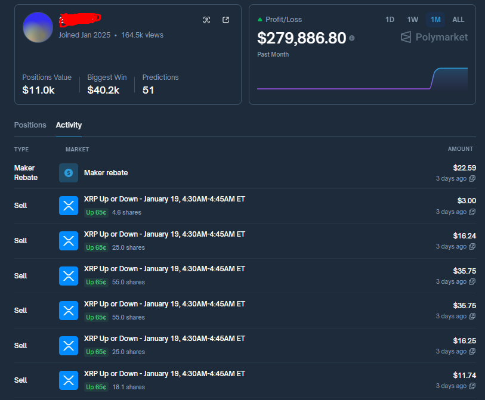
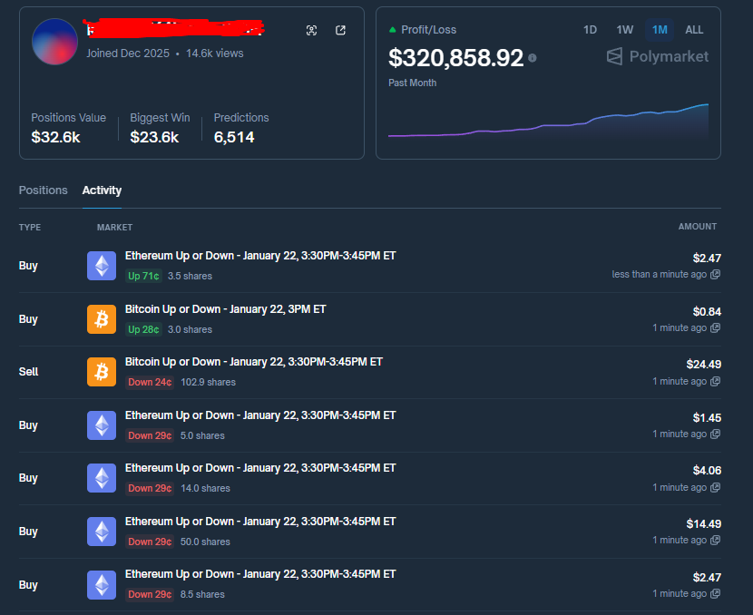
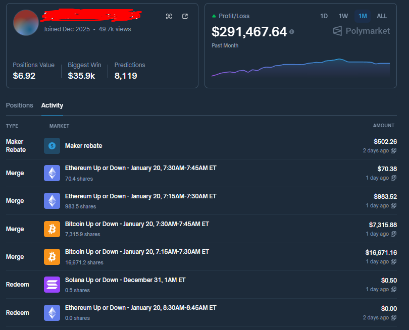
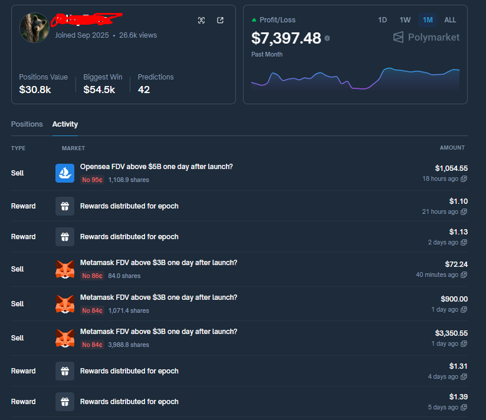
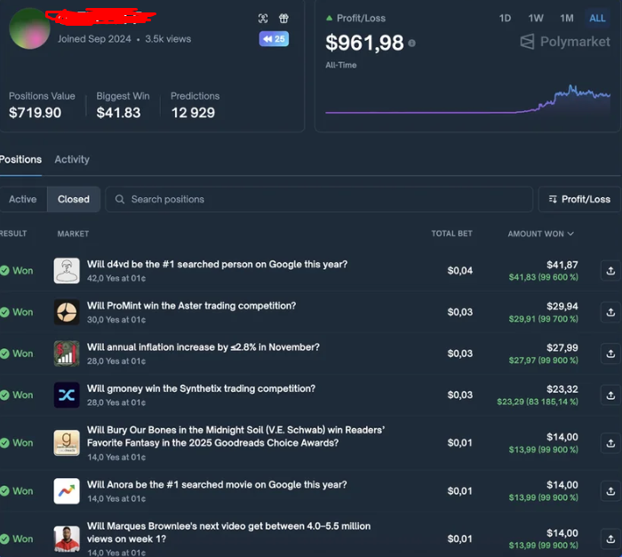
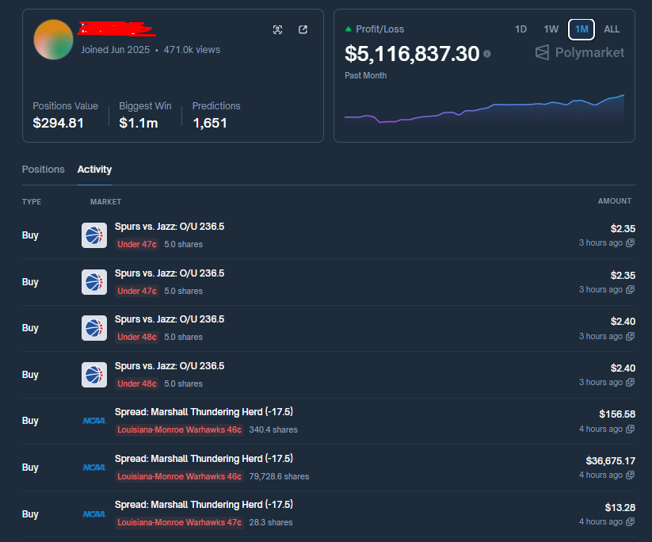
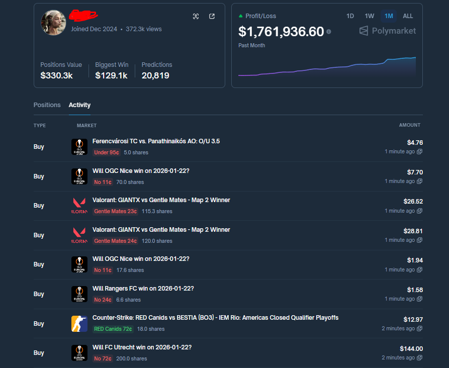

# Polymarket Arbitrage Bot | Polymarket Trading Bot with 7 Strategies

**Professional Polymarket Bot for Automated Arbitrage Trading for suitable income**

> **Need help running this project or want an updated version?**  
> 📱 **Telegram**: [@qntrade](https://t.me/qntrade)  
---

## 📝 Description

**Polymarket Arbitrage Bot** - The ultimate automated trading solution for Polymarket arbitrage opportunities. This **Polymarket trading bot** automatically scans markets, detects arbitrage opportunities, and executes profitable trades when Yes/No ticket prices sum to less than 1.0.

**Current Version Update**: This version specifically addresses and resolves the critical 3.15% profit margin calculation issue, ensuring more accurate arbitrage detection and execution.

---

## ⭐ Why This Bot is "Better"  than other's.

### All-in-One Solution
Combines the best strategies from CRYINGLITTLEBABY, PolyFlashBot,  Dutch Book bots , etc into one powerful **Polymarket arbitrage trading bot**. No need to switch between multiple tools - everything you need is here.

### Low Entry Barrier
**Anyone can run it, no Python mastery needed.** Simple setup, clear documentation, and straightforward configuration. This **Polymarket trading bot** is designed for traders of all skill levels.

### Adaptive Execution
**Auto-adjusts for fees, market liquidity, and sudden volatility.** The bot intelligently adapts to market conditions, ensuring optimal execution even when conditions change rapidly.

### High Speed, Low Stress
**Trades thousands of micro-opportunities automatically.** Set it up, let it run, and watch it work. This **Polymarket arbitrage bot** handles the complexity so you don't have to.

> **Ready to get started?** Contact via Telegram [@qntrade](https://t.me/qntrade) for setup assistance and access to advanced features.

---

## 🎯 Arbitrage Strategies

I implemented these **7 Polymarket arbitrage trading strategies**  for premium version:

1. **Strategy 1**: Liquidity Absorption Flip  
Overview: Build a large low-cost position by soaking bot liquidity, then briefly force the reference market price at resolution to flip the outcome and cash the higher Polymarket payout.


2. **Strategy 2**: Orderbook Parity Arbitrage (Pre-Fee Era)  - <span style="background-color: #4CAF50; color: white; padding: 2px 8px; border-radius: 4px; font-weight: bold;">Current repo's plan</span>  
Overview: Exploited brief moments where YES + NO priced below $1 on short windows, buying both sides simultaneously and holding to settlement to harvest tiny, repeatable mispricings—an edge erased by the 3.15% fee.  
Contrast — Post-Fee Adaptation: Liquidation Momentum Filter  
Overview: After fees killed parity arbitrage, the surviving bot shifted to entering only during forced-liquidation spikes, trading explosive moves where payout asymmetry outweighed fees, proving the edge wasn’t speed but adaptive logic.

3. **Strategy 3**: Structural Spread Lock  
Overview: Trade short-duration Polymarket markets by exploiting order-book imbalances—buying both sides during panic mispricing and holding to settlement to capture the guaranteed spread minus fees, independent of market direction

4. **Strategy 4**: Systematic NO Farming  
Overview: Consistently bet NO on overhyped outcomes, exploiting the fact that most prediction markets statistically resolve to NO while the crowd overpays for unlikely “miracle” outcomes.

5. **Strategy 5**:  Long-Shot Floor Buying  
Overview: Buy YES shares at the absolute minimum price (≈0.1¢) across thousands of markets, capping downside per bet while relying on rare but inevitable long-shot resolutions to generate asymmetric upside.

6. **Strategy 6**: Spread Farming  
Overview: Use a high-frequency bot on Polymarket’s CLOB to repeatedly buy at the bid and sell at the ask, capturing tiny spreads thousands of times per day—sometimes hedged across platforms to neutralize price risk.


7. **Strategy 7**: High-Probability Auto-Compounding  
Overview: A fully automated bot repeatedly trades short-duration crypto up/down markets by buying high-probability contracts (≈$0.90–$0.99), capturing small spreads and incentives thousands of times a day to compound returns purely through execution and scale.

> **Note**: Many advanced trading strategies are implemented in this **Polymarket arbitrage bot**. To access the full feature set and detailed strategy documentation, please contact via Telegram [@qntrade](https://t.me/qntrade).

### Strategy Images

<table>
<tr>
<td></td>
<td></td>
</tr>
<tr>
<td></td>
<td></td>
</tr>
<tr>
<td></td>
<td></td>
</tr>
<tr>
<td colspan="2"></td>
</tr>
</table>

---

## 🎯 About This Polymarket Bot

This **Polymarket arbitrage bot** is a powerful automated trading system that detects and executes arbitrage opportunities when the sum of Yes/No ticket prices on Polymarket is less than 1.0. This **Polymarket trading bot** implements multiple advanced strategies for optimal performance.

Built with real-world trading in mind, this bot handles the complexities of:
- Real-time market monitoring across hundreds of markets
- Precise profit margin calculations (including the 3.15% fix)
- Automated trade execution via Web3
- Comprehensive data logging and analysis
- Risk management and adaptive execution

Whether you're a seasoned trader or just getting started, this **Polymarket arbitrage trading bot** makes automated arbitrage accessible and profitable.

---

## 🎯 Key Features

- **Real-time Price Monitoring**: Tracks Yes/No ticket prices across multiple markets in real-time
- **Advanced Arbitrage Detection**: Automatically detects when `yes_price + no_price < 0.99` condition is met
- **Multiple Trading Strategies**: This Polymarket bot implements various arbitrage strategies (contact @qntrade for full access)
- **Adaptive Execution**: Auto-adjusts for fees, market liquidity, and volatility
- **Data Logging**: Saves price data to CSV and SQLite DB (for arbitrage opportunity analysis)
- **Automatic Trade Execution**: Automatic order execution via Web3 (optional)
- **3.15% Issue Resolution**: Fixed profit margin calculation for accurate arbitrage detection
- **Low Entry Barrier**: Easy setup, no advanced Python knowledge required
- **High-Speed Processing**: Handles thousands of micro-opportunities automatically

---

## 🚀 Quick Guide

### Prerequisites

- Python 3.8 or higher
- Polymarket account and wallet (for actual trading with this Polymarket trading bot)
- Polygon network RPC access

### Installation

1. **Clone or download the repository**
```bash
cd polymarket_arbitrage_bot
```

2. **Create and activate virtual environment** (recommended)
```bash
python3 -m venv venv
source venv/bin/activate  # Windows: venv\Scripts\activate
```

3. **Install required packages**
```bash
pip install -r requirements.txt
```

4. **Set up environment variables**
```bash
cp .env.example .env
# Open .env file and modify with actual values
```

### Configuration

Configure your **Polymarket arbitrage trading bot** by adjusting settings in the `.env` file:

- `MIN_PROFIT_MARGIN`: Minimum profit margin (default: 0.01 = 1%)
- `SCAN_INTERVAL`: Market scan interval (seconds)
- `MAX_MARKETS_TO_MONITOR`: Number of markets to monitor simultaneously
- `PRIVATE_KEY`: Wallet private key (required for actual trading)
- `ENABLE_DATA_LOGGING`: Enable/disable data logging

> **Advanced configurations available**: This Polymarket bot supports many additional strategies and optimizations. Contact [@qntrade](https://t.me/qntrade) for advanced settings and custom configurations.

### Usage

#### Data Logging Mode (record prices only, no trading)
```bash
# Leave PRIVATE_KEY empty in .env to only perform data logging
python bot.py
```

In this mode, the Polymarket trading bot:
- Periodically queries prices of active markets
- Saves price data to CSV and SQLite DB
- Outputs to console when arbitrage opportunities are found (does not execute trades)

#### Actual Trading Mode
```bash
# Set PRIVATE_KEY in .env and run
python bot.py
```

**⚠️ Warning**: Actual trading mode uses real funds. Use only after sufficient testing.

#### Monitor Specific Markets Only
```python
bot = PolyArbitrageBot(market_ids=["market-id-1", "market-id-2"])
bot.run()
```

### Data Analysis

```bash
# Analyze last 24 hours of data
python3 analyze_data.py

# Analyze last 1 hour of data
python3 analyze_data.py 1

# Analysis + CSV export
python3 analyze_data.py 24 --export
```

For detailed terminal commands, see [COMMANDS.md](COMMANDS.md).

> **Need help?** Contact via Telegram [@qntrade](https://t.me/qntrade) for setup assistance or updated versions of this Polymarket trading bot.

---

## ⚖️ Disclaimer

Each arbitrage strategy requires individual fine-tuning to align with specific user requirements.
This **Polymarket bot** is provided for educational and research purposes. The developer is not responsible for any losses that may occur when using it for actual trading. Please use only after sufficient testing and verification.

**Important Notes:**
- API Rate Limits: Polymarket API has request limits. Set `SCAN_INTERVAL` appropriately.
- Gas Fees: Polygon network has low gas fees, but gas fees can eat into profits when targeting small profits.
- Slippage: Slippage may occur due to price movements during actual trading with this Polymarket trading bot.
- Concurrency: Arbitrage requires "concurrency". If you buy a Yes ticket and the No ticket price rises in the meantime, losses may occur.

---

## 📝 License

This project is freely available for educational purposes.

---

## 🔍 Keywords & Tags

**Polymarket Bot** | **Polymarket Trading Bot** | **Polymarket Arbitrage Bot** | **Polymarket Arbitrage Trading Bot** | Automated Trading | Prediction Markets | Arbitrage Trading | Polymarket Automation | Crypto Trading Bot | DeFi Arbitrage | Market Making | Price Arbitrage | Polymarket API | Web3 Trading | Polygon Network | Automated Arbitrage | Trading Bot | Polymarket Strategies

---

**Search Terms**: polymarket bot, polymarket trading bot, polymarket arbitrage bot, polymarket automation, polymarket trading strategies, automated polymarket trading, polymarket price arbitrage, polymarket bot python, polymarket arbitrage opportunities

---

## 📱 Contact

Telegram: [@qntrade](https://t.me/qntrade)

---

## 📚 Additional Resources

- [Polymarket API Documentation](https://docs.polymarket.com)
- [CLOB API Documentation](https://docs.polymarket.com/developers/CLOB)
- [py-clob-client GitHub](https://github.com/Polymarket/py-clob-client)
- [COMMANDS.md](COMMANDS.md) - Detailed terminal commands guide

---

## 💡 Advanced Features & Support

This **Polymarket arbitrage trading bot** includes many advanced strategies and optimizations. The current public version focuses on core arbitrage detection with the 3.15% issue resolution. For access to:

- Advanced trading strategies
- Optimized configurations
- Custom market filters
- Enhanced profit calculations
- Real-time WebSocket integration
- Multi-market parallel processing
- Risk management features

**Contact** via Telegram [@qntrade](https://t.me/qntrade) (see top of README).
